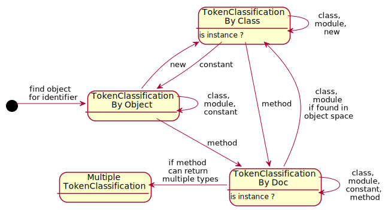

# Type inference

With type inference, the data type of an expression can be deduced, which allows providing meaningful autocompleter 
suggestions or documentation for a class or method.

The type inference strategies below take only the global scope into account (e.g. like when evaluating a simple line on the console).
For longer console input or complete ruby files, one would have to consider nested scopes and visibility of variables by building an abstract syntax tree.

## Forward Evaluation Resolver

    first identifier → token → next token → …

Tries to find the object corresponding to the first identifier, then evaluates subsequent tokens
using introspection where possible.

<dl>
<dt>TokenClassificationByObject:</dt>
<dd>We have a reference to the exact object in ObjectSpace.</dd>
<dt>TokenClassificationByClass:</dt>
<dd>We know the class in ObjectSpace, but it is not instantiated.</dd>
<dt>TokenClassificationByDoc:</dt>
<dd>Fallback to documentation to know what type a method returns (since Ruby is not 
statically 
typed, introspection cannot provide the return types).</dd>
</dl>



## Backtracking Resolver

This approach tries to guess the most likely type starting from the last token.
Tree of possibilities, but is narrowed down by matches for previous tokens.
 
    … → previous token → last token

1. last token  
   ↓
2. Which types respond to that token?  
   ↓
3. Which of these types can be returned by previous token?

Usually already with two tokens, the possibilities can be reduced to one.

### Example:

```ruby
unknown_reference.entities.length.to_s
```

1. `Array#to_s`, **`Fixnum#to_s`**, `Float#to_s`, `Hash#to_s`, `NilClass#to_s`…

2. `Array#length`, `Hash#length`, **`Sketchup::Entities#length`**, …

3. **`Sketchup::Model#entities`**, **`Sketchup::Model#active_entities`**, **`Sketchup::ComponentDefinition#entities`**, 
**`Sketchup::Group#entities`**