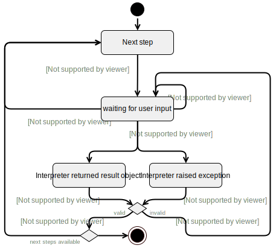

# Ruby Tutorial JSON format

The implementation of the tutorials can be found in `src/ae_console/features/feature_ruby_tutorials.rb` and `….js`. The tutorial data files are located in the Resources folder for each language. By default, all English tutorials (fallback) are listed in the user interface, and overriden by localized tutorials if identical file names are found in the directory of the current locale. Thus the file name should not be changed when localizing tutorials, therefore the title within the JSON is intended.

This data format is loosely based on [Try Ruby](https://github.com/easydatawarehousing/TryRuby/)'s format with several adaptations:

- Tutorial steps are a sequences/array, not an unordered dictionary with string keys of the sequence numbers.
- No need for URL-encoding strings, use `\n` instead of `<br/>`
- `load_code` `prev;` is not supported because it requires too exceptional code paths.

### State machine



### JSON format

Documented using [MSON](https://github.com/apiaryio/mson) notation.

- **`title`** (string) - The title of the tutorial that is displayed in the user interface.
- **`steps`** (array)
  - **`preparation_code`** (string, optional) - A string of Ruby code (lines separated by `\n`) which ensures any required code objects and references are created.
  - **`text`** (string) - The descriptive text that is initially displayed when the user starts this step.
  - **`tip`** (string or array of strings, optional) - A helpful text that is displayed when the user clicks the "tip" button.
  - **`load_code`** (string, optional) - A primer Ruby code that is loaded into the code editor.
  - **`solution_code`** (string, optional) - A string of Ruby code which solves the task and fulfills the validation.
  - One Of (optional)
    - **`validate_result_regexp`** (string)
      A string of a regular expression which will be applied on the string representation (`inspect`) of the evaluation result and matches if the result is valid.
    - **`validate_result_code`** (string)
      A string of Ruby code which receives the Ruby object resulting from evaluation as a variable `result` and returns a boolean whether is valid.
    - **`validate_stdout_regexp`** (string)
      A string of a regular expression which will be applied on the stdout string recorded during evaluation and matches if the result is valid.
    - **`validate_error_regexp`** (string)
      A string of a regular expression which will be applied on a caught error object's message and matches if it contains an expected error.
    - **`validate_error_code`** (string)
      A string of Ruby code which receives a caught error object and returns a boolean whether this error is expected.
  - **`ok`** (string) - A text message that is displayed when the solution was validated as correct.
  - **`error`** (string) - A text message that is displayed when the solution was not yet correct.

#### Minimal example:

```json
{
  "title": "1. Introduction",
  "steps": [
    {
      "text": "An array <code>[]</code> is a container data structure in which you can put other objects. Try to create an array containing a number.",
      "validate_result_regexp": "^\\[-?\\d+\\]$",
      "ok": "Great!",
      "error": "Try again."
    }
  ]
}
```
